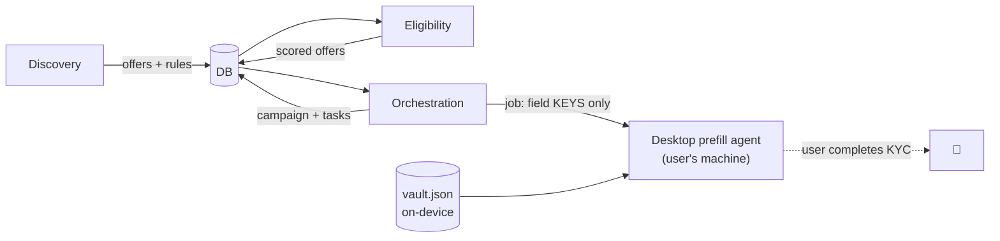

# AGENTS.md

Two things live under the word "agent" in this repo, and this file covers both:

1. **[Product agents](#part-1--the-product-agents)** — the autonomous/assistive
   components that discover offers, score them, orchestrate campaigns, and
   pre-fill bank applications.
2. **[Working in this repo](#part-2--working-in-this-repo-ai-coding-agents)** —
   conventions for AI coding agents (Claude Code and friends) making changes.
   This section is the machine-readable companion to [CLAUDE.md](./CLAUDE.md).

---

## Part 1 — The product agents

YieldFlow is a small fleet of narrow, auditable agents rather than one monolith.
Each has a clear input, output, and boundary.

### 1. Discovery agent — *find & normalize offers*
- **Code:** `src/lib/discovery/` (`provider.ts`, `extract.ts`, `ingest.ts`, `verify-links.ts`), run by `src/db/discover.ts` (`npm run db:discover`).
- **Does:** fetches public offer-list pages, (optionally) LLM-extracts them, normalizes into the institution→product→offer→requirement tree, dedupes, diffs changes into `offer_change_log`, verifies each application link resolves.
- **Boundary:** only public offer lists — **never** bank application pages, never bot-evasion. Every offer stored with `extractionConfidence` + `verificationStatus` + source link. LLM extraction is gated on `ANTHROPIC_API_KEY`; without it, the curated snapshot is the baseline.

### 2. Eligibility agent — *score offers per user*
- **Code:** `src/lib/eligibility.ts` + `src/lib/yield.ts`.
- **Does:** a **pure function** that walks each offer's rules tree + disqualifiers (geo, existing-customer, prior-bonus, ChexSystems velocity) and computes capital-days economics (annualized, after-tax, feasibility). Materializes `user_offer_eligibility`.
- **Boundary:** deterministic and side-effect-free except the final upsert; no external calls.

### 3. Orchestration agent — *run the campaign*
- **Code:** `src/lib/orchestration.ts` + `src/lib/execution/adapter.ts`.
- **Does:** turns an offer into a campaign — ordered task chain (open → fund → direct-deposit → confirm → **recall**), per-requirement progress, and an **approval-gated** transfer plan.
- **Boundary:** the `ExecutionAdapter` is a **stub** — it advances task state and returns deep-links but **moves no money**. `transfer_plan.approved_by_user_at` is a hard gate.

### 4. Desktop prefill agent — *assisted sign-up*
- **Code:** `agent/run.mjs` (single-file Node CLI, `playwright-core`). Contract in `src/lib/agent.ts` → `GET /api/agent/job/:id`.
- **Does:** runs on the **user's machine, in their real Chrome**. Fetches the job (field **keys** only — no PII), merges values from the on-device vault (`~/.yieldflow/vault.json`), navigates the application, pre-fills fields (across frames, split/masked identity fields, `<label>`-only fields), and **stops at the identity/KYC step**.
- **Boundary:** no stealth, no fingerprint spoofing, no CAPTCHA solving, **never clicks submit/e-sign/identity**. Opt-in identity autofill fills DOB/SSN *only* if the user put them in the local vault — and still stops for review + submit. Degrades to copy-paste if a bank blocks automation.
- **Proven by:** `agent/test/drive.test.mjs` (60 assertions, 11 DOM pattern-classes). See [agent/COVERAGE.md](./agent/COVERAGE.md).

### How they hand off



---

## Part 2 — Working in this repo (AI coding agents)

> The authoritative, always-read guide is [CLAUDE.md](./CLAUDE.md). This section
> restates the essentials for any agent and adds the test/verify loop.

### Golden rules

- **Money in integer cents; rates in basis points.** Never floats for money. Use `centsToUsd` / `bpsToPercentString` from `src/lib/yield.ts`.
- **After any change under `src/db/schema/`**, run `npm run db:generate` and **commit the new `drizzle/*.sql`.** Migrations never run in the Vercel build.
- **Pages that read the DB** set `export const dynamic = "force-dynamic"` (no DB at build time).
- **Schema modules stay import-acyclic** — keep the documented cross-domain links as plain text pointers, not FKs.
- **The only write path in the web app** is `src/app/campaigns/actions.ts` server actions.
- **Never** weaken the agent boundary: no auto-submit, no stealth, no sending identity values to the server.

### The build & verify loop (run before committing)

```bash
npm run build              # Vercel parity — must pass
cd agent && npm test       # 60 agent-logic assertions (needs a Chromium binary)
npm run db:verify-banks    # 18/18 bank entry paths (needs local.db: db:reset && db:discover)
```

| Command | What it checks |
|---|---|
| `npm run db:reset` | wipe + migrate + seed `local.db` |
| `npm run db:discover` | ingest the live offer set + recompute eligibility |
| `npm run db:verify-banks` | every bank's offer → campaign → agent-job entry path |
| `cd agent && npm test` | the `driveSteps` engine against faithful fixtures, headless |

### Adding coverage for a new real-bank DOM quirk

The harness is how we turn a real-bank failure into a permanent regression test:

1. Add a faithful fixture under `agent/test/fixtures/` reproducing the quirk (record real actions to `window.__events`).
2. Add assertions in `agent/test/drive.test.mjs` (import the real `driveSteps`).
3. Run `cd agent && npm test`, watch it fail, fix `agent/run.mjs`, re-run to green.
4. Update the matrix in [agent/COVERAGE.md](./agent/COVERAGE.md).

This is the loop that took the harness from 27 → 60 assertions (split/masked
identity fields, `<label for>`-only fields, iframes, in-frame wizards).

### Git & PRs

- Develop on the designated feature branch; commit with clear messages; push with `git push -u origin <branch>`.
- After pushing, ensure an open **draft** PR exists for the branch.
- Keep secrets and any model identifier out of commits, PR bodies, and code.

### Repo map (where things live)

```
src/db/schema/*.ts    37 tables, one file per domain (a-…i), barrel index.ts
src/db/index.ts       libSQL client + drizzle() singleton
src/db/seed.ts        Regions example (idempotent); discover.ts / verify-banks.ts scripts
src/lib/yield.ts      pure economics (capital-days, annualized, after-tax, feasibility)
src/lib/eligibility.ts    evaluate + recompute eligibility (Domain D)
src/lib/orchestration.ts  startCampaign → campaign + task chain + transfer plan
src/lib/discovery/    offer discovery pipeline
src/lib/agent.ts      builds the desktop-agent job payload (no PII)
src/app/…             App Router pages + /api route handlers
agent/run.mjs         the desktop agent (Playwright) — the whole thing
agent/test/           the automated click-through harness + fixtures
```

See [ARCHITECTURE.md](./ARCHITECTURE.md) for the full system design.
