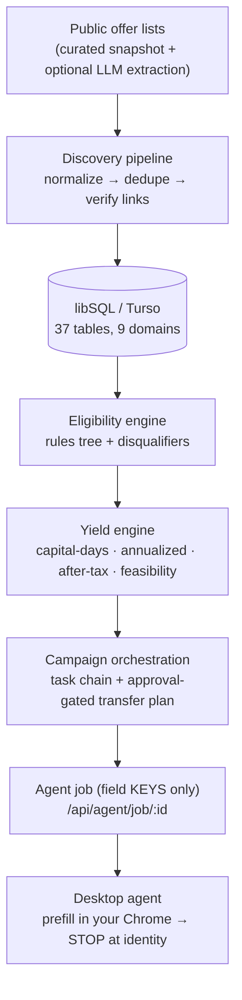

# YieldFlow — Architecture

How the system is built, end to end: the data model, the discovery → eligibility
→ campaign → agent pipeline, the yield math, the browser-agent engine, and the
security model. For the product pitch see the [README](./README.md); for the
table-level ERD see [ERD.md](./ERD.md); for what's test-proven see
[agent/COVERAGE.md](./agent/COVERAGE.md).

---

## 1. The thesis, as code

A sign-up bonus is a **fixed payout decoupled from balance**. So the return is
`bonus ÷ (capital × days)` — the scarce resource is **capital-days**, and the
whole system optimizes **bonus dollars per capital-day**. Every layer below
exists to (a) find offers, (b) turn their fine print into something computable,
(c) score them per user, and (d) run the accounts while keeping capital moving.



---

## 2. Stack & runtime

| Layer | Choice | Why |
|---|---|---|
| Web | **Next.js 15** App Router (server components) | DB-reading pages are `force-dynamic`; no DB at build time |
| Language | **TypeScript** everywhere | the requirement tree + money math want strong types |
| DB | **Drizzle ORM** on **libSQL** (`@libsql/client`) | SQLite locally (`file:local.db`), **Turso** in prod — same driver, switched by `DATABASE_URL`. libSQL persists writes on Vercel serverless where a plain SQLite file would not. |
| Validation | **Zod** on API route inputs | |
| Desktop agent | **`playwright-core`**, `channel:"chrome"` | drives the user's *real* installed Chrome — nothing to download, no headless fingerprint |
| Live extraction | **`@anthropic-ai/sdk`** (optional) | LLM-extract public offer lists; gated on `ANTHROPIC_API_KEY` |

**Money is integer cents; rates are basis points** (1% = 100 bps). Never floats
for money — `centsToUsd` / `bpsToPercentString` in `src/lib/yield.ts`.

---

## 3. Data model — 37 tables, 9 domains

One file per domain in `src/db/schema/`, barrel-exported from `schema/index.ts`;
Postgres→SQLite type helpers in `schema/_shared.ts` (`pk()`, `timestamps()`,
`jsonStringArray()`). Full column listings in [ERD.md](./ERD.md).

| Domain | File | Tables (highlights) | Purpose |
|---|---|---|---|
| **A** Institutions | `a-institution.ts` | institution, product, rate_tier, footprint | who issues offers, and where they operate |
| **B** Offers | `b-offers.ts` | offer, offer_source, offer_ingest_run, offer_raw_document, offer_change_log | discovered offers + provenance + change history |
| **C** Requirements | `c-requirements.ts` | requirement_group, requirement, disqualifier, geo_eligibility | the **AND/OR requirement tree** + exclusions |
| **D** Users | `d-users.ts` | user_profile, user_address, chexsystems_event, **user_offer_eligibility** | the user + their materialized per-offer scores |
| **E** Accounts | `e-accounts.ts` | linked_account, account_balance_snapshot, transaction | (backlog) aggregated balances for DD detection |
| **F** Campaigns | `f-campaigns.ts` | campaign, campaign_requirement_progress, requirement_evidence, campaign_task | a bonus being pursued + live progress |
| **G** Money | `g-money.ts` | transfer_plan, transfer_leg, fdic_exposure | approval-gated movement + FDIC limits |
| **H** Payout | `h-payout.ts` | bonus_payout, tax_lot, performance_period | (backlog) reconciliation + tax lots |
| **I** Agent/Compliance | `i-agent.ts` | agent_run, agent_decision, approval_request, notification, audit_log, consent_record | run log, approvals, and the audit trail |

**The moat is Domain C.** A bonus's fine print ("$1,000 cumulative payroll ACH
within 90 days, external transfers don't count, GA/AL/FL only, not in the last 12
months") becomes a **recursive `requirement_group` (ALL/ANY) → `requirement`
tree** plus `disqualifier` and `geo_eligibility` rows — an executable object the
eligibility engine walks, not prose a human re-reads.

**Acyclicity rule:** a few cross-domain links (product→requirement,
campaign_task→agent_run, notification→campaign) are plain text pointers, not hard
FKs, to keep the schema modules import-acyclic. Self-referential FKs (nested
requirement groups, task `blocked_by`) use `AnySQLiteColumn`.

---

## 4. Discovery pipeline (`src/lib/discovery/`)

Turns messy public offer data into normalized, deduped, link-verified rows —
**never** scraping bank application pages or evading bots (only public offer
lists, which return 200 to normal fetches).

```
sources.ts   → typed list of public offer-list pages (Doctor of Credit, NerdWallet, …)
extract.ts   → LLM-extract offers into the DiscoveredOffer shape (gated on ANTHROPIC_API_KEY)
provider.ts  → curatedProvider (hand-verified snapshot) + liveWebProvider (crawler seam)
ingest.ts    → upsert institution→product→offer→requirement tree; diff into offer_change_log
verify-links.ts → each applicationUrl is fetched and must resolve to a real form (not a homepage)
discover.ts  → `npm run db:discover`: curated + live → ingest → expire stale → recompute eligibility
```

- **Idempotent & additive** — dedupe on `(institution, title)` / content hash;
  re-running updates fields and writes an `offer_change_log` row per changed
  field. It never wipes existing rows (unlike `seed.ts`).
- **Trust is explicit** — every offer carries `extractionConfidence` +
  `verificationStatus` + a source link. Curated is the reliable baseline; live
  extraction only augments.
- **Observability** — `GET /api/discovery/status` returns per-source run stats,
  active/expired counts, and recent changes.

---

## 5. Eligibility + yield (`src/lib/eligibility.ts`, `src/lib/yield.ts`)

`evaluateEligibility(ctx)` is a **pure function** — given the user, address,
ChexSystems events, prior campaigns, and the offer's rules, it returns
`{ status, blockingDisqualifierIds, requiredCapitalCents, holdDays, economics,
feasibility }`. Rules: geo footprint, existing-customer / new-customer lookback,
prior-bonus window, and ChexSystems account-open **velocity**.

`src/lib/yield.ts` is the pure economics core (no DB), mirroring the
`user_offer_eligibility` columns:

```ts
capitalDays(capitalCents, holdDays)                       // capital × days — the scarcity metric
projectedAnnualizedYieldBps({bonusCents, interestCents, capitalCents, holdDays})
projectedNetAfterTaxBps(grossBps, marginalRateBps)        // bonus taxed as ordinary income
feasibilityScore({ddDifficulty, priorOutcomes})           // P(success), 0..1
rankScore(eligibility)                                     // the optimizer objective
```

`recomputeEligibility(userId)` materializes a `user_offer_eligibility` row per
active offer (the dashboard and `/api/offers` read these). Worked example — Chase
$400 on $1,000 held 90 days: `400/1000 × 365/90 = 162%` annualized, ~110% after a
32% marginal rate. `npm run db:verify-banks` prints the whole scored slate.

---

## 6. Campaign orchestration (`src/lib/orchestration.ts`)

`startCampaign(userId, offerId)` builds, in one sequence:

- a **campaign** with derived dates (`requirementsDeadline`,
  `earliestSafeCloseDate = start + max(clawbackDays, requirementWindowDays)`,
  `plannedCloseDate`);
- a **`campaign_requirement_progress`** row per requirement;
- an **ordered `campaign_task` chain** via `blocked_by_task_id`: open_account →
  enroll_estatements → initiate_transfer (fund) → maintain → confirm_bonus_posted
  → **close_account (recall)** — each task carries generated `instructions`
  (CTA label, deep-link, copy-to-clipboard values, DD gotchas, computed dates);
- a **`transfer_plan`** (`awaiting_approval`, `approved_by_user_at` null = **hard
  gate**) with fund + wind-down legs.

`src/lib/execution/adapter.ts` is the `ExecutionAdapter` seam. The shipped
`StubExecutionAdapter` only advances task state and returns deep-links — **no
money moves.** A real Plaid + ACH adapter lands here after account linking
(Domain E, backlog).

---

## 7. The desktop agent (`agent/run.mjs`)

A hosted app can't drive a user's browser or complete their KYC — so the
"agentic sign-up" is a **local Node CLI** (single file, `playwright-core` only)
that runs on the user's machine, in their real Chrome, with them present.

**Handoff contract** (`src/lib/agent.ts` → `GET /api/agent/job/:id`): the cloud
sends *which* offer, the step plan, and the **field keys** to fill — **never
values, never PII.** Values live only in the on-device vault
(`~/.yieldflow/vault.json`).

**`driveSteps(page, vault, job, opts)`** — the click-through engine, injectable
(`opts.choose`) so the test harness can script the "user":

```
loop, page by page (max 8):
  dismissConsent          → clear cookie/consent overlays (across all frames)
  prefill                 → fill matching fields across the page + every iframe
  atIdentityStep?         → if SSN/DOB fields visible → STOP (hand over)
  findChoiceGroups        → required radios (e.g. "bundle savings?") → user picks
  findAdvanceCtas         → rank candidate CTAs (dedupe, deprioritize nav/footer decoys)
  clickByText             → re-locate at click time (survives stale re-render), follow new tabs
  no-progress signature   → if a click changed nothing → hand over instead of looping
```

**What makes prefill robust** (each proven by a harness fixture — §8):

- Resolves a field's label from `aria-label` **and** `<label for>`, wrapping
  `<label>`, and `aria-labelledby` — computed in-browser (real forms often label
  a field only by an associated `<label>` with an opaque id).
- Distributes one vault value across **split fields** — DOB into Month/Day/Year
  (`<select>`s or inputs), SSN into 3 boxes — and fills **masked** (`type=password`)
  SSN inputs.
- Reaches **into iframes** for both prefill and the identity-stop, and clicks
  CTAs inside an iframe so an in-frame wizard advances.
- **Opt-in identity autofill:** if the user put `dateOfBirth`/`ssn` in their local
  vault, prefill fills them too — then the agent **still stops** at the identity
  step for review + CAPTCHA + submit. It never clicks submit, e-sign, or KYC.

Every run writes a diagnostics folder (`~/.yieldflow/runs/<ts>/`: `run.log`,
screenshots, a `.webm`) recording field **keys** and page labels only — never
vault values.

---

## 8. Testing & verification

Two automated harnesses run the **real** code (no logic mocks):

**Agent logic** — `cd agent && npm test` (`agent/test/drive.test.mjs`): imports
the actual `driveSteps`/`prefill`/`atIdentityStep` and runs them against 17
faithful fake bank-flow fixtures in headless Chromium with a scripted user.
**60 assertions across 12 scenarios**, ~13 s wall. Covers 11 real-bank DOM
pattern-classes and asserts the identity stop every time.

**Per-bank entry path** — `npm run db:verify-banks` (`src/db/verify-banks.ts`):
for all 18 active offers, starts a campaign, builds the agent job, and asserts
the handoff is well-formed (application URL + channel, the autofill/identity
field contract, step chain, progress URL). **18/18**, ~142 ms/bank.

The honest boundary: these prove the *logic* and the *entry path*. Driving a
*specific* bank's live DOM still needs a real run in the user's Chrome (datacenter
IPs are bot-blocked, and KYC is theirs) — see the ⧗ column in
[agent/COVERAGE.md](./agent/COVERAGE.md).

---

## 9. Security & compliance model

| Principle | Mechanism |
|---|---|
| **No custody of funds** | account opening is a deep-link handoff; movement is planned + stubbed, never executed |
| **No money moves without consent** | `transfer_plan.approved_by_user_at` is a hard gate; `ExecutionAdapter` is a stub |
| **Identity data stays on-device** | vault is local; the cloud sends field **keys** only; the `/vault` page builds the file client-side |
| **The agent never impersonates** | real Chrome, real session, no fingerprint spoofing, no CAPTCHA solving; it **stops at KYC** |
| **Everything is auditable** | outbound clicks → `audit_log`; agent runs → `agent_run` + local `run.log`; approvals → `approval_request` |
| **Outside money-transmitter licensing** | by never touching funds and keeping KYC with the user |

---

## 10. What's built vs. modeled

**Built & tested:** discovery (curated + optional live), eligibility + yield,
campaign orchestration + cockpit, the desktop prefill agent, the web handoff API,
affiliate click redirector, discovery observability.

**Modeled in schema, natural next build-out:** crawlers (Domain B), Plaid
aggregation + a direct-deposit classifier (Domain E), the capital-days optimizer
+ real transfer execution (Domain G), payout/tax reconciliation (Domain H),
agent approvals UI (Domain I). See [BACKLOG.md](./BACKLOG.md).
