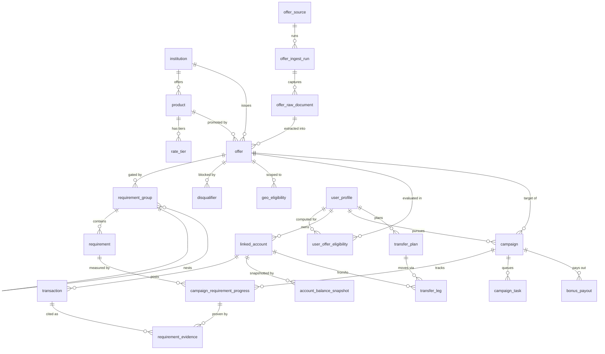

# YieldFlow — Entity Relationship Model

**37 tables across 9 domains.** Every table has a UUID text primary key (`id`)
and `created_at` / `updated_at` timestamps (omitted from the listings below).

> Note on the count: the source spec's prose says "41 tables," but its own table
> index enumerates 37 tables with column definitions. This implementation
> contains all 37 defined tables — no phantom tables were invented to reach 41.

## Postgres → SQLite/libSQL type translation

The source ERD is written in Postgres types; libSQL/SQLite has none of them
natively. The mappings, applied consistently via helpers in
`src/db/schema/_shared.ts`:

| Spec (Postgres) | This schema (SQLite/libSQL) |
|---|---|
| `uuid` PK | `text` PK, defaulted with `crypto.randomUUID()` |
| `timestamptz` | `integer` (unix seconds), `{ mode: "timestamp" }` ↔ JS `Date` |
| enum | `text` with a typed `{ enum: [...] }` union (checked in TS) |
| `uuid[]` / `char(2)[]` / `text[]` | json-mode `text` typed as `string[]` |
| `jsonb` | json-mode `text` |
| `bigint` / `int` cents | `integer` (JS number is exact to 2^53) |
| `numeric(3,2)` | `real` |
| self-referential FK | `AnySQLiteColumn`-annotated `.references()` |

## Core relationships

## Domains & tables

### A — Institution & Product Reference
`institution` (self-ref `partner_bank_id` for sponsor banks), `institution_footprint`,
`product`, `rate_tier`

### B — Offer Discovery & Normalization
`offer_source`, `offer_ingest_run`, `offer_raw_document` (immutable evidence),
`offer` (normalized canonical offer), `offer_change_log`

### C — Requirement Modeling *(the moat)*
`requirement_group` (self-ref AND/OR/N_OF tree), `requirement` (typed windows &
`deposit_source_constraint`), `disqualifier`, `geo_eligibility`

### D — User, Identity & Eligibility
`user_profile`, `user_address`, `user_credential_ref` (vault pointer only),
`chexsystems_event` (velocity governor), `user_offer_eligibility` (materialized
verdict with `capital_days`)

### E — Linked Accounts & Balances
`linked_account`, `account_balance_snapshot`, `transaction` (self-ref
`matched_transfer_id`; `ach_sec_code` + `dd_classification` = the DD signal)

### F — Campaign Orchestration
`campaign`, `campaign_requirement_progress`, `requirement_evidence`,
`campaign_task` (self-ref `blocked_by_task_id`)

### G — Money Movement
`transfer_plan` (approval-gated), `transfer_leg` (self-ref `depends_on_leg_id`),
`fdic_exposure`

### H — Payout, Tax & Performance
`bonus_payout`, `tax_lot` (1099-INT), `performance_period`

### I — Agent Execution, Compliance & Audit
`agent_run`, `agent_decision`, `approval_request`, `notification`, `audit_log`,
`consent_record`

## The three tables that make or break it

1. **`requirement_group` + `requirement`** — modeling requirements as an
   executable AND/OR tree with typed windows is the moat. If it's a text column,
   you've built a tracker, not an agent.
2. **`transaction.ach_sec_code` / `dd_classification`** — direct-deposit
   recognition is probabilistic and bank-specific. Every campaign outcome feeds
   the classifier; the dataset compounds.
3. **`user_offer_eligibility.capital_days`** — the resource the optimizer
   allocates. The objective is a constrained knapsack over capital-days, not
   "highest bonus."
