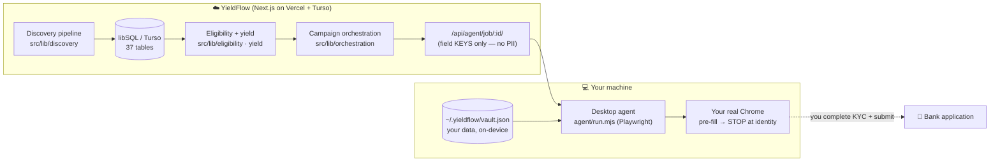

<div align="center">

# 💸 YieldFlow

### Your idle cash, working at 100%+ APY — by harvesting bank sign-up bonuses on autopilot.

**YieldFlow takes a pool of cash and rotates it through US bank sign-up bonuses**, opening the right accounts, hitting each bonus's requirements, collecting the payout, and recalling the money — then doing it again. It targets a **net yield north of 100%** and **~$3,000+/year** for a user eligible for the full slate of offers. Advisory-first: **it never takes custody of your funds.**


[**What it does**](#-what-it-does) · [**The math**](#-the-math-why-100-is-real) · [**Pricing**](#-pricing--net-value) · [**Quickstart**](#-quickstart) · [**Architecture**](./ARCHITECTURE.md) · [**Agents**](./AGENTS.md) · [**Coverage**](./agent/COVERAGE.md)

</div>

---

## 🎯 What it does

A bank sign-up bonus is a **fixed dollar amount decoupled from your balance** — Chase pays $400 whether you park $1,000 or $100,000. So the return is inversely proportional to *how much* capital you tie up and *for how long*. Tie up $1,000 for 90 days to earn $400, free it, and redeploy — and that dollar is working at **162% annualized.**

YieldFlow turns that insight into a system:

```
   discover offers  →  score eligibility & yield  →  run campaigns  →  rotate capital
   (18 live banks)     (per-user, GA demo)           (open→fund→DD       (bonus $ per
                                                       →collect→recall)    capital-day)
```

1. **Discovers** live US checking/savings bonuses and models each one's fine print as an executable **AND/OR requirement tree** (direct-deposit thresholds, minimum balances, hold windows, geo/ChexSystems disqualifiers).
2. **Scores** every offer *for you* — eligibility + capital required + **after-tax annualized yield**, ranked by the core metric: **bonus dollars per capital-day.**
3. **Runs the campaign** — an ordered task chain (open account → fund → trigger qualifying direct deposit → confirm the bonus posted → **recall your money**) with pre-filled bank deep-links and a wind-down schedule so capital never sits idle.
4. **Pre-fills the application** in *your own browser* via a local desktop agent — then stops at identity verification, which is always yours to complete. No stealth, no custody, no KYC-by-bot.

> **Advisory-first, by design.** YieldFlow plans and assists; it never moves or holds your money. Account opening is a deep-link handoff (you complete KYC), and money movement stays behind an explicit approval gate. This keeps YieldFlow outside money-transmitter licensing — and keeps you in control.

---

## 📈 The math (why 100%+ is real)

Because capital **rotates**, each dollar-day is extraordinarily productive. These are the **real offers** in the current dataset, scored for a demo user eligible for the whole slate (`npm run db:verify-banks` + the dashboard produce these numbers):

| Bank | Bonus | Capital held | Days | Annualized | After-tax | **Net of 20% fee** |
|---|--:|--:|--:|--:|--:|--:|
| Truist One Checking | $400 | $500 | 90 | **324%** | 221% | **259%** |
| Fifth Third Momentum | $300 | $500 | 90 | **243%** | 165% | **194%** |
| Chase Total Checking | $400 | $1,000 | 90 | **162%** | 110% | **130%** |
| Wells Fargo Everyday | $325 | $1,000 | 90 | **132%** | 90% | **105%** |
| Capital One 360 | $250 | $1,000 | 75 | **122%** | 83% | **97%** |
| SoFi Checking+Savings | $400 | $5,000 | 25 | **117%** | 79% | **94%** |

*(annualized = bonus ÷ capital × 365 ÷ hold-days; after-tax assumes a 32% marginal rate; net-of-fee subtracts YieldFlow's 20% cut before annualizing.)*

**The full eligible slate today: 11 offers → $3,375 in bonuses.** You don't need $38k sitting still to earn it — you rotate a **working pool of a few thousand dollars** through the offers over the year, because each one only ties capital for its 25–90 day window. That rotation is exactly what the optimizer sequences (maximize bonus-$ per capital-day, subject to ACH throughput, ChexSystems velocity, and FDIC limits).

---

## 💵 Pricing & net value

**$20 / month + 20% of the sign-up bonuses you actually earn.** That's it. No cut of your capital, no fee on bonuses you don't collect.

Worked example — a user who harvests the **full $3,375 eligible slate** in a year:

| | Amount |
|---|--:|
| Gross bonuses earned | **+$3,375** |
| YieldFlow subscription (12 × $20) | −$240 |
| YieldFlow performance fee (20% × $3,375) | −$675 |
| **Your net, after all fees** | **≈ +$2,460 / year** |

You keep **~73%** of every bonus dollar. And the fee is *structurally* dominated by the yield: even after YieldFlow's 20% cut, the top offers still annualize **well over 100%** (Truist 259%, Chase 130%, Wells Fargo 105% — see the last column above). You are paying $20 + 20% to capture a return that no savings account, CD, or T-bill comes close to.

> Illustrative, not a guarantee or financial advice. Actual results depend on your eligibility, available capital, direct-deposit setup, and diligent execution of each campaign. Bonuses are taxable income.

---

## ✅ What's proven (performance & testing)

YieldFlow's economics engine and its browser agent are covered by automated tests that run the **real** code — no mocks of the logic.

| Metric | Value |
|---|---|
| **Agent-logic assertions** | **60 passing** across 12 scenarios / 17 fixtures |
| **Bank entry-paths verified** | **18 / 18** (`npm run db:verify-banks`) |
| **Agent harness runtime** | ~13 s end-to-end (real headless Chromium, incl. browser launch) |
| **Job build latency** | ~**142 ms/bank** (offer → campaign → agent job, measured over 18 offers) |
| **Prefill** | fills a page's fields in a single pass, across frames, incl. `<label for>`/`aria-labelledby`-only fields |
| **Data model** | 37 tables, 9 domains, one migration set |

The agent harness runs the actual `driveSteps` click-through engine against faithful fake bank-flow fixtures in headless Chromium, proving **11 distinct real-bank DOM pattern-classes** — SPA gates, decoy-CTA selection, required radio choices, split/masked identity fields, `<label>`-only fields, `<iframe>`-embedded forms, in-frame multi-step wizards, cookie banners, stale re-renders, new-tab CTAs, and the no-progress handover — all while **always stopping at the identity/KYC step**. See [`agent/COVERAGE.md`](./agent/COVERAGE.md) for the per-bank + per-pattern matrix.

```bash
cd agent && npm test        # 60 assertions, headless Chromium
npm run db:verify-banks     # 18/18 bank entry paths
```

---

## 🚀 Quickstart

**Run the whole thing locally with zero external services** (SQLite file, no login wall):

```bash
npm install
cp .env.example .env          # DATABASE_URL defaults to file:local.db
npm run db:reset              # build local.db (37 tables) + demo data
npm run db:discover           # ingest the 18-bank live offer set + score eligibility
npm run dev                   # http://localhost:3000
```

Then drive the agent from the `agent/` folder (needs Node 18+ and Google Chrome):

```bash
cd agent && npm install
node run.mjs --setup                         # enter your details once → local vault (never leaves your machine)
node run.mjs                                  # arrow-key menu: pick an offer, start a campaign
node run.mjs http://localhost:3000/campaigns/<id>          # opens Chrome, pre-fills, stops at identity
node run.mjs http://localhost:3000/campaigns/<id> --auto   # same, auto-answers the step prompts
```

Full agent guide: [`agent/README.md`](./agent/README.md). Deploy to Vercel + Turso: [see below](#-deploy-vercel--turso).

---

## 🗺️ How it fits together



Three reads to go deeper:

- **[ARCHITECTURE.md](./ARCHITECTURE.md)** — the full system: 9 data domains, the discovery→eligibility→campaign→agent data flow, the yield math, the browser-agent engine, and the security model.
- **[AGENTS.md](./AGENTS.md)** — every autonomous/assistive "agent" in the product (discovery, eligibility, orchestration, the desktop prefill agent) **and** the conventions for AI coding agents working in this repo.
- **[agent/COVERAGE.md](./agent/COVERAGE.md)** — what's test-proven, per bank and per DOM pattern-class.

---

## 🧩 Stack

- **Next.js 15** (App Router) · **TypeScript** · **Tailwind CSS**
- **Drizzle ORM** on **libSQL** (`@libsql/client`) — **SQLite locally** (`file:local.db`), **Turso** in production (same driver, switched by `DATABASE_URL`; libSQL *is* SQLite but persists writes on Vercel serverless).
- **Zod** for API validation · **Playwright** (`playwright-core`) for the desktop agent · **Anthropic SDK** for optional live offer extraction.

---

## 🔌 Pages & API

| Route | What it shows |
|---|---|
| `/` | Offer pipeline ranked by risk-adjusted after-tax annualized yield + total required capital |
| `/offers/[id]` | Requirement tree (AND/OR), disqualifiers, geo eligibility, economics |
| `/campaigns/[id]` | The campaign cockpit — task chain, deep-links, approval-gated transfer plan, recall schedule |
| `/vault` | "Enter my details" — builds & downloads your local agent vault (identity data never touches the server) |
| `/admin` | Operational controls — toggle feature flags (e.g. the `business_accounts` beta) |
| `/business` | **Gated** Business-accounts tab (hidden unless `business_accounts` is on) — business checking bonuses ($300–$1,000+) |
| `GET /api/offers` · `GET /api/campaigns` | Ranked offers / campaigns as JSON |
| `GET /api/agent/job/[id]` | The desktop-agent job (offer URL, steps, field **keys** — never PII) |
| `GET /api/eligibility?bonusCents=&capitalCents=&holdDays=&marginalRateBps=&ddDifficulty=` | Pure yield calculator |
| `GET /api/discovery/status` | Discovery pipeline health (per-source runs, offer counts, recent changes) |

```bash
curl "localhost:3000/api/eligibility?bonusCents=40000&capitalCents=100000&holdDays=90&marginalRateBps=3200&ddDifficulty=probabilistic"
# -> projectedAnnualizedYieldBps: 16222 (162%), projectedNetAfterTaxBps: 11031 (110%)
```

---

## ☁️ Deploy (Vercel + Turso)

Local dev needs nothing external. Production needs a Turso database (a plain SQLite file doesn't persist writes on Vercel serverless).

1. **Create a Turso DB** ([CLI install](https://docs.turso.tech/cli/installation)):
   ```bash
   turso db create yieldflow
   turso db show yieldflow --url        # -> DATABASE_URL (libsql://…)
   turso db tokens create yieldflow     # -> DATABASE_AUTH_TOKEN
   ```
2. **Apply the schema to Turso** (one-off, from your machine — never in the Vercel build):
   ```bash
   DATABASE_URL="libsql://…" DATABASE_AUTH_TOKEN="…" npm run db:migrate
   DATABASE_URL="libsql://…" DATABASE_AUTH_TOKEN="…" npm run db:seed   # optional demo data
   ```
3. **Set env vars in Vercel** (Project → Settings → Environment Variables): `DATABASE_URL`, `DATABASE_AUTH_TOKEN`.
4. **Deploy** — push to the repo (Vercel auto-detects Next.js) or `vercel --prod`.

| Var | Local | Production |
|---|---|---|
| `DATABASE_URL` | `file:local.db` | `libsql://<db>-<org>.turso.io` |
| `DATABASE_AUTH_TOKEN` | *(empty)* | Turso token |
| `ANTHROPIC_API_KEY` | *(optional)* | enables live offer extraction |

Secrets live in `.env` (gitignored); `.env.example` is the committed template.

---

## 🛡️ Posture & boundaries

Built **advisory-first with assisted execution**, deliberately outside money-transmitter licensing and KYC-impersonation:

- **Automated:** offer discovery, extraction, eligibility, yield scoring, requirement tracking, deadline alerts, transfer planning.
- **One-click, approval-gated:** transfer legs between accounts *you already own*.
- **Assisted handoff:** account opening via deep-link + on-device vault autofill — **the agent always stops at identity/KYC and never clicks submit.**
- **Never:** takes custody of funds, moves money without your approval, spoofs fingerprints, evades bank security, or sends your SSN/DOB to our servers.

The crawlers (Domain B), Plaid aggregation + DD classifier (Domain E), the capital-days optimizer + transfer execution (Domain G), and payout/tax reconciliation (Domain H) are modeled in the schema and are the natural next build-out — see [`BACKLOG.md`](./BACKLOG.md).

---

<div align="center">
<sub>Not financial advice. Bank bonuses are taxable income. YieldFlow is a planning &amp; automation tool — you own the accounts, complete identity verification, and approve every transfer.</sub>
</div>
